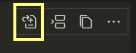
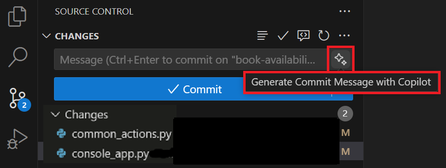

---
lab:
    title: 'Exercise - Develop new code features using GitHub Copilot (Python)'
    description: 'Learn how to accelerate the development of new code features using GitHub Copilot in Visual Studio Code.'
---

# Develop new code features using GitHub Copilot

GitHub Copilot's code completion and interactive chat features help developers write code faster and with fewer errors. It provides suggestions for code snippets, functions, and even entire classes based on the context of the code being written. In this exercise, you use GitHub Copilot to accelerate the development of new code features in Visual Studio Code.

This exercise should take approximately **30** minutes to complete.

> **IMPORTANT**: To complete this exercise, you must provide your own GitHub account and GitHub Copilot subscription. If you don't have a GitHub account, you can <a href="https://go.microsoft.com/fwlink/?linkid=2320148" target="_blank">sign up</a> for a free individual account and use a GitHub Copilot Free plan to complete the exercise. If you have access to a GitHub Copilot Pro, GitHub Copilot Pro+, GitHub Copilot Business, or GitHub Copilot Enterprise subscription from within your lab environment, you can use your existing GitHub Copilot subscription to complete this exercise.

## Before you start

Your lab environment must include the following: Git 2.48 or later, Python 3.10 or later, Visual Studio Code with the Python extension form Microsoft, and access to a GitHub account with GitHub Copilot enabled.

If you're using a local PC as a lab environment for this exercise:

- For help configuring your local PC as your lab environment, open the following link in a browser: <a href="https://microsoftlearning.github.io/mslearn-github-copilot-dev/Instructions/Labs/LAB_AK_00_configure_lab_environment_py.html" target="_blank">Configure your lab environment resources</a>.

- For help enabling your GitHub Copilot subscription in Visual Studio Code, open the following link in a browser: <a href="https://go.microsoft.com/fwlink/?linkid=2320158" target="_blank">Enable GitHub Copilot within Visual Studio Code</a>.

If you're using a hosted lab environment for this exercise:

- For help enabling your GitHub Copilot subscription in Visual Studio Code, paste the following URL into a browser's site navigation bar: <a href="https://go.microsoft.com/fwlink/?linkid=2320158" target="_blank">Enable GitHub Copilot within Visual Studio Code</a>.

- Open a command terminal and then run the following commands:

    To ensure that Visual Studio Code is configured to use the correct version of Python, verify your Python installation is version 3.10 or later:

    ```bash
    python --version
    ```

    To ensure that Git is configured to use your name and email address, update the following commands with your information, and then run the commands:

    ```bash

    git config --global user.name "John Doe"

    ```

    ```bash

    git config --global user.email johndoe@example.com

    ```

## Exercise scenario

You're a developer working in the IT department of your local community. The backend systems that support the public library were lost in a fire. Your team needs to develop a temporary project to help the library staff manage their operations until the system can be replaced. Your team chose GitHub Copilot to accelerate the development process.

An initial version of your library application was tested by end users and several additional features are requested. Your team agreed to work on the following features:

- Book availability: Enable a librarian to determine the availability status of a book. This feature should display a message indicating that a book is available for loan or the return due date if the book is currently on loan to another patron.

- Book loans: Enable a librarian to loan a book to a patron (if the book is available). This feature should display the option for a patron to receive a book on loan, update Loans.json with the new loan, and display updated loan details for the patron.

- Book reservations: Enable a librarian to reserve a book for a patron (unless the book is already reserved). This feature should implement a new book reservation process. This feature may require creating a new Reservations.json file along with the new classes and interfaces required to support the reservation process.

Each team member will work on one of the new features and then regroup. You'll work on the feature to determine the availability status of a book. Your coworker will work on the feature to loan a book to a patron. The final feature, to reserve a book for a patron, will be developed after the other two features are completed.

This exercise includes the following tasks:

1. Set up the Library application in Visual Studio Code.

1. Use Visual Studio Code to create a GitHub repository for the Library application.

1. Create a "book availability" branch in the code repository.

1. Develop a new "book availability" feature.

    - Use GitHub Copilot suggestions to help implement the code more quickly and accurately.
    - Sync your code updates to the "book availability" branch of your remote repository.

1. Merge your "book availability" updates into the main branch of the repository.

## Set up the Library application in Visual Studio Code

You need to download the existing application, extract the code files, and then open the project in Visual Studio Code.

Use the following steps to set up the Library application:

1. Open a browser window in your lab environment.

1. To download a zip file containing the Library application, paste the following URL into your browser's address bar: [GitHub Copilot lab - develop code features](https://github.com/MicrosoftLearning/mslearn-github-copilot-dev/raw/refs/heads/main/DownloadableCodeProjects/Downloads/AZ2007LabAppM3Python.zip)

    The zip file is named **AZ2007LabAppM3Python.zip**.

1. Extract the files from the **AZ2007LabAppM3Python.zip** file.

    For example:

    1. Navigate to the downloads folder in your lab environment.

    1. Right-click **AZ2007LabAppM3Python.zip**, and then select **Extract all**.

    1. Select **Show extracted files when complete**, and then select **Extract**.

1. Open the extracted files folder, then copy the **AccelerateDevGHCopilot** folder to a location that's easy to access, such as your Windows Desktop folder.

1. Open the **AccelerateDevGHCopilot** folder in Visual Studio Code.

    For example:

    1. Open Visual Studio Code in your lab environment.

    1. In Visual Studio Code, on the **File** menu, select **Open Folder**.

    1. Navigate to the Windows Desktop folder, select **AccelerateDevGHCopilot** and then select **Select Folder**.

1. In the Visual Studio Code EXPLORER view, verify the following project structure:

    - AccelerateDevGHCopilot/library
        ├── application_core
        ├── console
        ├── infrastructure
        └── tests
        └── readme.md

1. Ensure that the application runs successfully.

    For example, open a terminal in Visual Studio Code, navigate to the **AccelerateDevGHCopilot/library** directory, and run the following command:

    ```bash
    python -m unittest discover -v tests
    ```

    You'll see some Warnings, but there shouldn't be any Errors.

## Create the GitHub repository for your code

Creating the GitHub repository for your code will enable you to share your work with others and collaborate on the project.

> **NOTE**: You use your own GitHub account to create a private GitHub repository for the library application.

Use the following steps to complete this section of the exercise:

1. Open a browser window and navigate to your GitHub account.

    The GitHub login page is: [https://github.com/login](https://github.com/login).

1. Sign in to your GitHub account.

1. Open your GitHub account menu, and then select **Your repositories**.

1. Switch to the Visual Studio Code window.

1. In Visual Studio Code, open the Source Control view.

1. Select **Publish to GitHub**.

1. Name for the repository **AccelerateDevGHCopilot**.

    > **NOTE**: If you're not signed in to GitHub in Visual Studio Code, you'll be prompted to sign in. Once you're signed in, authorize Visual Studio Code with the requested permissions.

1. Select **Publish to GitHub private repository**.

1. Notice that Visual Studio Code displays status messages during the publish process.

    When the publish process is finished, you'll see a message informing you that your code was successfully published to the GitHub repository that you specified.

1. Switch to the browser window for your GitHub account.

1. Open the new AccelerateDevGHCopilot repository in your GitHub account.

    If you don't see your AccelerateDevGHCopilot repository, refresh the page. If you still don't see the repository, try the following steps:

    1. Switch to Visual Studio Code.
    1. Open your notifications (a notification was generated when the new repository was published).
    1. Select **Open on GitHub** to open your repository.

## Create a new branch in the repository

Before you start developing the new "book availability" feature, you need to create a new branch in the repository. This enables you to work on the new feature without affecting the main branch of the repository. You can merge the new feature into the main branch when the code is ready.

Use the following steps to complete this section of the exercise:

1. Ensure that you have the AccelerateDevGHCopilot project open in Visual Studio Code.

1. Select the Source Control view and ensure that the local repository is synchronized with the remote repository (Pull or Sync).

1. In the bottom-left corner of the window, select **main**.

1. To create a new branch, type **book availability** and then select **+ Create new branch**.

1. To push the new branch to the remote repository, select **Publish Branch**.

## Use GitHub Copilot to Develop a new "book availability" feature

In this section of the exercise, you use GitHub Copilot to develop a new feature for the Library application. The requested feature will enable a librarian to check whether a book is available for loan, a common scenario that isn't currently supported by your current Library application.

To implement the book availability feature, you'll need to complete the following updates:

- Add a new **SEARCH_BOOKS** action to the **CommonActions** enum in **library/console/common_actions.py**.

- Update the **WriteInputOptions** method in **library/console/console_app.py**.

  - Add support for the new **CommonActions.SEARCH_BOOKS** option.
  - Display the option to check if a book is available for loan.

- Update the **ReadInputOptions** method in **library/console/console_app.py**.

  - Add support for the new **CommonActions.SEARCH_BOOKS** option.

- Update the **PatronDetails** method in **library/console/console_app.py**.

  - Add **CommonActions.SEARCH_BOOKS** to **options** before calling **ReadInputOptions**.
  - Add an **else if** to handle the **SEARCH_BOOKS** action.
  - The **else if** block should call a new method named **SEARCH_BOOKS**.

- Create a new **SEARCH_BOOKS** method in **library/console/console_app.py**.

  - The **SEARCH_BOOKS** method should read a user provided book title.
  - Check if a book is available for loan, and display a message stating either:

    - "**book.title** is available for loan", or
    - "**book.title** is on loan to another patron. The return due date is **loan.DueDate**."

GitHub Copilot Chat can help you implement the code updates needed to complete the new feature.

- You can use inline chat sessions to implement smaller, more discreet code updates based on your requirements.
- You can use the Chat view to work on larger code updates that may require a more conversational and iterative approach.

### Implement "book availability" updates using Copilot inline chat

**Copilot Inline Chat** sessions allow you to interact with GitHub Copilot directly in your code editor. You can use inline chat to ask questions, request code suggestions, and get explanations for the code generated by GitHub Copilot.

Use the following steps to complete this section of the exercise:

1. Open the EXPLORER view.

1. Expand the **library/console** project.

1. Open the **console/common_actions.py** file, and then **select** the **CommonActions** class.

    You need to add a new **SEARCH_BOOKS** action to **CommonActions**.

1. Open the inline chat: Hover on the selection, right click and a menu opens, choose **"Copilot"**, and select **Editor Inline Chat**.

1. Enter the following prompt:

    ```plaintext
    Update selection to include a new `SEARCH_BOOKS` action.
    ```

    GitHub Copilot should suggest a code update that adds the new **SEARCH_BOOK** action to the **CommonActions** class.

1. Review the suggested update and then select **Accept**.

    Your updated code should look similar to the following code snippet:

    ```python

    class CommonActions(Flag):
        REPEAT = 0
        SELECT = auto()
        QUIT = auto()
        SEARCH_PATRONS = auto()
        SEARCH_BOOKS = auto() # added
        RENEW_PATRON_MEMBERSHIP = auto()
        RETURN_LOANED_BOOK = auto()
        EXTEND_LOANED_BOOK = auto()
    ```

    Notice the addition of `SEARCH_BOOKS = auto()` to `CommonActions`.

1. Open the **library/console/console_app.py** file.

1. Find and then select the `write_input_options` method in the `ConsoleApp` class. Hover on the selection, right click and a menu opens, choose **"Copilot"**, and select **Editor Inline Chat**.

    You need to add support for the new `CommonActions.SEARCH_BOOKS` option. If the `SEARCH_BOOKS` option is present, display the option to check if a book is available for loan.

1. Open the inline chat and then enter the following prompt:

    ```plaintext
    Update selection to include an option for the `CommonActions.SEARCH_BOOKS` action. Use the letter "b" and the message "to check for book availability".
    ```

    GitHub Copilot should suggest a code update that adds a new `if` block for the `SEARCH_BOOKS` action.

1. Review the suggested update and then select **Accept**.

    The suggested update should be similar to the following code snippet:

    ```python
        def write_input_options(self, options):
        print("Input Options:")
        if options & CommonActions.RETURN_LOANED_BOOK:
            print(' - "r" to mark as returned')
        if options & CommonActions.EXTEND_LOANED_BOOK:
            print(' - "e" to extend the book loan')
        if options & CommonActions.RENEW_PATRON_MEMBERSHIP:
            print(' - "m" to extend patron\'s membership')
        if options & CommonActions.SEARCH_PATRONS:
            print(' - "s" for new search')
        if options & CommonActions.SEARCH_BOOKS:
            print(' - "b" to check for book availability')
        if options & CommonActions.QUIT:
            print(' - "q" to quit')
        if options & CommonActions.SELECT:
            print(' - type a number to select a list item.')
    ```

1. Scroll down to find and then select the `_handle_patron_details_selection` method (or the input handling section) in the **library/console/console_app.py** file.

    Once again, you need to add support for the new `CommonActions.SEARCH_BOOKS` option. Include a case that handles the user selecting the `SEARCH_BOOKS` action (for example, when the user enters "b").

1. Open the inline chat and then enter the following prompt:

    ```plaintext
    Update selection to include an option for the `CommonActions.SEARCH_BOOKS` action.
    ```

    GitHub Copilot should suggest an update that adds a new `elif` block that handles the user selecting the `SEARCH_BOOKS` action.

1. Review the suggested update and then select **Accept**.

    The suggested update should be similar to the following code snippet:

    ```python
    def _handle_patron_details_selection(self, selection, patron, valid_loans):
    # ...existing code...

        elif selection == 'b':
            # Placeholder for book search functionality
            print("Book search functionality is not implemented yet.")
            return ConsoleState.PATRON_DETAILS
        elif selection.isdigit():
            idx = int(selection)
            if 1 <= idx <= len(valid_loans):
                self.selected_loan_details = valid_loans[idx - 1][1]
                return ConsoleState.LOAN_DETAILS
            print("Invalid selection. Please enter a number shown in the list above.")
            return ConsoleState.PATRON_DETAILS
        else:
            print("Invalid input. Please enter a number, 'm', 's', 'b', or 'q'.")
            return ConsoleState.PATRON_DETAILS
    ```

#### Use Copilot Inline Chat to share a code selection to GitHub Copilot Chat

1. Ensure that GitHub Copilot Chat is open in **Ask mode**.

1. There are two things that you need to accomplish:

    - You need to add `CommonActions.SEARCH_BOOKS` to `options` before calling `_get_patron_details_input`.
    - You also need to add an `if` or `elif` block to handle the `"b"` selection for the `SEARCH_BOOKS` action. The block should call a new method named `search_books`.

    You can address both requirements with the same prompt.

1. Locate and then **select** the `patron_details` method in the **library/console/console_app.py** file.

1. With the `patron_details` method still selected, hover on the selection. **Right click** and a menu opens, choose **"Copilot"** and select **"Add Selection to Chat"**.

1. Enter the following prompt:

    ```plaintext
    @workspace Update selection to add `CommonActions.SEARCH_BOOKS` to `options` before calling `_get_patron_details_input`. Add an `if` or `elif` block to handle the `"b"` selection for the `SEARCH_BOOKS` action. The block should call a new method named `search_books`.
    ```

    GitHub Copilot Chat should suggest a code update that adds `CommonActions.SEARCH_BOOKS` to `options` before calling `_get_patron_details_input`. For the supplied code, select the "Apply in Editor" icon.

    

1. Review the suggested update and then select **Accept**.
    ```python
    def patron_details(self) -> ConsoleState:
        patron = self.selected_patron_details
        print(f"\nName: {patron.name}")
        print(f"Membership Expiration: {patron.membership_end}")
        loans = self._loan_repository.get_loans_by_patron_id(patron.id)
        print("\nBook Loans History:")

        valid_loans = self._print_loans(loans)

        if valid_loans:
            options = (
                CommonActions.RENEW_PATRON_MEMBERSHIP
                | CommonActions.SEARCH_PATRONS
                | CommonActions.QUIT
                | CommonActions.SELECT
                | CommonActions.SEARCH_BOOKS  # Added SEARCH_BOOKS to options
            )
            selection = self._get_patron_details_input(options)
            return self._handle_patron_details_selection(selection, patron, valid_loans)
        else:
            print("No valid loans for this patron.")
            options = (
                CommonActions.SEARCH_PATRONS
                | CommonActions.QUIT
                | CommonActions.SEARCH_BOOKS  # Added SEARCH_BOOKS to options
            )
            selection = self._get_patron_details_input(options)
            return self._handle_no_loans_selection(selection)

    def _handle_patron_details_selection(self, selection, patron, valid_loans):
        if selection == 'q':
            return ConsoleState.QUIT
        elif selection == 's':
            return ConsoleState.PATRON_SEARCH
        elif selection == 'm':
            status = self._patron_service.renew_membership(patron.id)
            print(status)
            self.selected_patron_details = self._patron_repository.get_patron(patron.id)
            return ConsoleState.PATRON_DETAILS
        elif selection == 'b':
            return self.search_books()  # Call the new search_books method
        elif selection.isdigit():
            idx = int(selection)
            if 1 <= idx <= len(valid_loans):
                self.selected_loan_details = valid_loans[idx - 1][1]
                return ConsoleState.LOAN_DETAILS
            print("Invalid selection. Please enter a number shown in the list above.")
            return ConsoleState.PATRON_DETAILS
        else:
            print("Invalid input. Please enter a number, 'm', 's', 'b', or 'q'.")
            return ConsoleState.PATRON_DETAILS

    def _handle_no_loans_selection(self, selection):
        if selection == 'q':
            return ConsoleState.QUIT
        elif selection == 's':
            return ConsoleState.PATRON_SEARCH
        elif selection == 'b':
            return self.search_books()  # Handle SEARCH_BOOKS when no loans
        else:
            print("Invalid input.")
            return ConsoleState.PATRON_DETAILS

    def search_books(self) -> ConsoleState:
        print("Book search functionality is not implemented yet.")
        return ConsoleState.PATRON_DETAILS

    ```
<!-- TODO: Delete or restore? Previous version that resulted in the Agent bug fix
     ```python

    def patron_details(self) -> ConsoleState:
    patron = self.selected_patron_details
    print(f"\nName: {patron.name}")
    print(f"Membership Expiration: {patron.membership_end}")
    loans = self._loan_repository.get_loans_by_patron_id(patron.id)
    print("\nBook Loans History:")

    valid_loans = self._print_loans(loans)

    if valid_loans:
        options = (
            CommonActions.RENEW_PATRON_MEMBERSHIP
            | CommonActions.SEARCH_PATRONS
            | CommonActions.QUIT
            | CommonActions.SELECT
            | CommonActions.SEARCH_BOOKS
        )
        selection = self._get_patron_details_input(options)
        if selection == 'b':
            return self.search_books()
        return self._handle_patron_details_selection(selection, patron, valid_loans)
    else:
        print("No valid loans for this patron.")
        options = (
            CommonActions.SEARCH_PATRONS
            | CommonActions.QUIT
            | CommonActions.SEARCH_BOOKS
        )
        selection = self._get_patron_details_input(options)
        if selection == 'b':
            return self.search_books()
        return self._handle_no_loans_selection(selection)

    def search_books(self) -> ConsoleState:
        print("Book search option selected.")
        return ConsoleState.PATRON_DETAILS
    ``` 

-->

    > **NOTE**: The code suggested by Inline chat may include stub code for the **search_books()** method as in the previous code sample. You can accept that code stub, but you'll implement the **search_books** method in the next section.

### Implement a SEARCH_BOOKS method using Copilot Chat Ask mode

There's one step remaining to implement the "book availability" updates, create the **search_books** method. The **search_books** method will read a user provided book title, check if a book is available for loan, and display a message indicating the book's availability status. You'll use the Chat view to evaluate the requirements and implement the **search_books** method.

GitHub Copilot's Chat view provides a conversational and interactive environment that isn't available when using inline chat. You can use the Chat view to ask questions, request code suggestions, and get explanations for the code generated by GitHub Copilot. The Chat view supports the following three modes:

- Ask mode: Ask mode is used to gain a better understanding of your codebase, brainstorm ideas, and help with coding tasks. The code suggestions generated in Ask mode can be implemented directly into your codebase or copied to the clipboard.
- Edit mode: Edit mode is used to make changes to your code, such as refactoring or adding new features. Edit mode can make edits across multiple files in your project.
- Agent mode: Agent mode is used to define a high-level task and to start an agentic code editing session to accomplish that task. In agent mode, Copilot autonomously plans the work needed and determines the relevant files and context. The agent can make changes to your code, run tests, and even deploy your application.
<!-- TODO: line below do we use all 3 listed modes? -->
You'll be using the **Inline Chat**, **Ask** and **Edit** modes to implement the **search_books** method.

Use the following steps to complete this section of the exercise:

1. Take a minute to consider the process requirements for the **search_books** method.

    What's the process that the method needs to complete? What's the return type for this method? Does it require parameters?

    The **search_books** method should implement the following process:

    1. Prompt the user for a book title.
    1. Read the user provided book title.
    1. Check if a book is available for loan.
    1. Display a message stating one of the following options:

        - "**{book.title}** is available for loan"
        - "**{book.title}** is on loan to another patron. The return due date is **{loan.due_date}**."

    To build the message options, your code will need to access the following JSON files:

    - **Books.json** is needed to find the matching **Title** and **Id**.
    - **BookItems.json** is needed to find the **BookId** for each physical copy of a book (where **BookId** matches the **Id** in **Books.json**).
    - **Loans.json** is needed to find the **ReturnDate** and **DueDate** for the matching **BookItemId** (where **BookItemId** matches the **Id** in **BookItems.json**).

> **Note:**  
> The **BookItemId** in **Loans.json** refers to the **Id** in **BookItems.json**.  
> The **BookId** in **BookItems.json** refers to the **Id** in **Books.json**.

1. Ensure that you have the following **search_books** method created in the **console_app.py** file:

    ```python

    def search_books(self) -> ConsoleState:
        print("Book search functionality is not implemented yet.")
        return ConsoleState.PATRON_DETAILS

    ```

    > **NOTE**: Be sure to remove any code comments created by GitHub Copilot. Unnecessary and inaccurate comments can negatively influence GitHub Copilot's suggestions.

1. Open the **console_app.py** in VSCode, select the **search_books** method.

1. Open the Chat view and then enter the following prompt:

    ```plaintext
    @workspace Update selection to obtain a book title. Prompt the user to "Enter a book title to search for". Read the user input and ensure the book title isn't null.
    ```

1. Review the suggested update.

    The suggested update should be similar to the following code snippet:

    ```python

    def search_books(self) -> ConsoleState:
        while True:
            book_title = input("Enter a book title to search for: ").strip()
            if not book_title:
                print("No input provided. Please enter a book title.")
            else:
                # Placeholder for future book search logic
                print(f"Searching for book titled: {book_title}")
                break
        return ConsoleState.PATRON_DETAILS

    ```

1. Hover the mouse pointer over the suggested code, and then select **Apply to library\console\console_app.py**.

    The suggested code should be visible in the code editor, with options to **Keep** or **Undo**.

1. In the code editor, to accept the suggested code, select **Keep**.

1. Select the **search_books** method.

1. Use drag-and-drop operations to add the following files to the Chat context:

    - library/console/**console_app.py** (current file selected)
    - library/console/**main.py**
    - library/infrastructure/Json/**Books.json**
    - library/infrastructure/Json/**Loans.json**
    - library/infrastructure/Json/**BookItems.json**
    - library/infrastructure/**json_data.py**
    - library/infrastructure/**json_loan_repository.py**

1. Enter the following prompt:

    ```plaintext
    @workspace provide a simple text overview plan of how to update the search_books method and ConsoleApps class to find a matching book title in the Books.json file. Use the user supplied book title to find a matching book. If a book is found, use Loans.json to check if the book is available for loan. If the book has been returned, display a message stating "book.title is available for loan". If the book is on loan, display a message stating "book.title is on loan to another patron. The return due date is loan.DueDate". Don't provide code yet. List the general change recommendations for each high level item as a numbered list of paragraphs.
    ```

1. Take a minute to review the suggested updates.

    The response should include the following information:

    ```plaintext

    1. Update the ConsoleApp class to access book data:  
    Add a reference to the book repository or the loaded books data from JsonData within the ConsoleApp class. This will allow the search_books method to access the list of all books and perform searches based on user input.
    
    2. Modify the search_books method to search for a book:  
    Update the search_books method to use the user-supplied book title to search for a matching book in the loaded books data (from Books.json). The search should be case-insensitive and match the title exactly or partially, depending on requirements.
    
    3. Check book availability using loan data:  
    Once a matching book is found, use the book's ID to find all related book items (copies) and then check the Loans.json data to determine if any copies are currently on loan (i.e., have a loan record with a null ReturnDate). If all copies are returned, the book is available for loan.
    
    4. Display book availability status to the user:  
    If at least one copy of the book is available (not currently on loan), display a message such as "book.title is available for loan." If all copies are on loan, display a message such as "book.title is on loan to another patron. The return due date is loan.DueDate," using the due date from the active loan.
    
    5. Handle no match or multiple matches:  
    If no book matches the search, display an appropriate message to the user. Optionally, if multiple books match, prompt the user to refine their search or select from a list.
    
    6. Keep user in the book search loop:  
    After displaying the result, allow the user to search for another book or return to the previous menu, maintaining a smooth user experience.

    ```

    > **NOTE**: you may have received code updates in the GitHub Copilot response. 
    > The code updates will be addressed in the next step.

    You can also use the Chat view's **Ask** mode to analyze code updates, then use the **Edit** mode to implement the code updates.

1. Review sample prompts (you will prompt later).

    ```plaintext

    Update the search_books method and ConsoleApp class so that when a user enters a book title, the app searches 
    Books.json for a matching title (case-insensitive, partial match allowed). If a match is found, check all 
    related BookItem records and their loan status in Loans.json. If any copy is not currently on loan (no active 
    loan or has a ReturnDate), display "book.title is available for loan". If all copies are on loan, display 
    "book.title is on loan to another patron. The return due date is loan.DueDate" (show the soonest due date). 
    Integrate this logic into the user flow and ensure clear user messaging.
    ```

    You can adjust the prompt to achieve specific requirements by asking Copilot to generate you a prompt from the Copilot feedback. A Copilot generated example prompt follows for review:

    ```plaintext

    Update the ConsoleApp class and its search_books method to implement the following:
    
    1. Add access to the loaded books data (from JsonData or a book repository) in ConsoleApp.
    2. In search_books, use the user-supplied book title to search for a matching book in Books.json (case-insensitive, partial or exact match).
    3. If a book is found, use its ID to find all related book items (copies) and check Loans.json to see if any copies are currently on loan (ReturnDate is null).
    4. If at least one copy is available, display: "book.title is available for loan." If all are on loan, display: "book.title is on loan to another patron. The return due date is loan.DueDate."
    5. If no book matches, inform the user. If multiple books match, prompt for refinement or selection.
    6. After displaying the result, allow the user to search again or return to the previous menu.
        
    Please provide the complete implementation for this book search and availability feature.
    ```

### Implement search_books method using Copilot Chat Edit mode

1. To switch the Chat view to the Edit mode, select **Set Mode**, and then select **Edit**.

    When prompted to start a new session, select **Yes**.

1. Use drag-and-drop operations to add the following files to the Chat context using **Chat Edit mode**:

    - library/console/**console_app.py**
    - library/console/**main.py**
    - library/infrastructure/**json_data.py**
    - library/infrastructure/Json/**Books.json**
    - library/infrastructure/Json/**Loans.json**
    - library/infrastructure/Json/**BookItems.json**

1. Select the **search_books** method from **console_app.py**.

1. Enter the following prompt:

    ```plaintext

    @workspace Update the ConsoleApp class so it can access the loaded books data from JsonData or a book repository, and update main.py to instantiate ConsoleApp with the loaded JsonData instance by passing json_data=json_data. In the search_books method, prompt the user for a book title and search for a matching book in Books.json using a case-insensitive, partial or exact match. If a book is found, use its ID to find all related book items (copies) and check Loans.json to determine if any copies are currently on loan (ReturnDate is null). If at least one copy is available, display a message stating the book is available for loan; if all are on loan, display a message with the book title and the due date of the loan. If no book matches, inform the user, and if multiple books match, prompt for refinement or selection. After displaying the result, allow the user to search again or return to the previous menu.
    ```

1. Take a minute to review the suggested updates in the console_app.py file.

    You can use **Previous** and **Next** to navigate through the suggested code updates, or you can scroll manually through the file.

    **console_app.py**

    Code updates that add the **json_data** dependency to the **console_app** constructor can be found near the top of the ConsoleApp class.

    ```python
    class ConsoleApp:
        def **init**(
            self,
            loan_service: ILoanService,
            patron_service: IPatronService,
            patron_repository: IPatronRepository,
            loan_repository: ILoanRepository,
            json_data=None,  # <-- Add json_data for direct access to books/items
            book_repository=None  # <-- Optionally allow a book repo
        ):
            self._current_state: ConsoleState = ConsoleState.PATRON_SEARCH
            self.matching_patrons = []
            self.selected_patron_details = None
            self.selected_loan_details = None
            self._patron_repository = patron_repository
            self._loan_repository = loan_repository
            self._loan_service = loan_service
            self._patron_service = patron_service
            self._json_data = json_data   # <-- store json_data
            self._book_repository = book_repository
    ```

    Code completes the `search_books` method to implement functionality in the stub code to check if to use **json_data** to find a book by title, retrieve its BookItem, check for an active loan, and display availability or loan status as requested.

    ```python
        def search_books(self) -> ConsoleState:
        while True:
            book_title = input("Enter a book title to search for: ").strip()
            if not book_title:
                print("No book title provided. Please try again.")
                continue

            # Case-insensitive, partial or exact match
            books = self._json_data.books
            matches = [b for b in books if book_title.lower() in b.title.lower()]

            if not matches:
                print("No matching books found.")
                again = input("Search again? (y/n): ").strip().lower()
                if again == 'y':
                    continue
                else:
                    return ConsoleState.PATRON_DETAILS

            if len(matches) == 1:
                book = matches[0]
            else:
                print("\nMultiple books found:")
                for idx, b in enumerate(matches, 1):
                    print(f"{idx}) {b.title}")
                selection = input("Select a book by number or 'r' to refine search: ").strip().lower()
                if selection == 'r':
                    continue
                if not selection.isdigit() or not (1 <= int(selection) <= len(matches)):
                    print("Invalid selection.")
                    continue
                book = matches[int(selection) - 1]

            # Find all book items (copies) for this book
            book_items = [bi for bi in self._json_data.book_items if bi.book_id == book.id]
            if not book_items:
                print("No copies of this book are in the library.")
                again = input("Search again? (y/n): ").strip().lower()
                if again == 'y':
                    continue
                else:
                    return ConsoleState.PATRON_DETAILS

            # Find all loans for these book items
            loans = self._json_data.loans
            on_loan = []
            available = []
            for item in book_items:
                # Find latest loan for this item (if any)
                item_loans = [l for l in loans if l.book_item_id == item.id]
                if item_loans:
                    # Get the most recent loan (by LoanDate)
                    latest_loan = max(item_loans, key=lambda l: l.loan_date or l.due_date or l.return_date or 0)
                    if latest_loan.return_date is None:
                        on_loan.append(latest_loan)
                    else:
                        available.append(item)
                else:
                    available.append(item)

            if available:
                print(f"Book '{book.title}' is available for loan.")
            else:
                # All copies are on loan, show due dates
                due_dates = [l.due_date for l in on_loan if l.due_date]
                if due_dates:
                    next_due = min(due_dates)
                    print(f"All copies of '{book.title}' are currently on loan. Next due date: {next_due}")
                else:
                    print(f"All copies of '{book.title}' are currently on loan.")

            again = input("Search for another book? (y/n): ").strip().lower()
            if again == 'y':
                continue
            else:
                return ConsoleState.PATRON_DETAILS 
    ```

    **main.py**

    Modified instantiation of `ConsoleApp` to pass in `json_data` so the app can access the JSON data files.

    ```python
    # ...existing code...
            app = ConsoleApp(
            loan_service=loan_service,
            patron_service=patron_service,
            patron_repository=patron_repo,
            loan_repository=loan_repo,
            json_data=json_data  # <-- Pass json_data so ConsoleApp can access books/items/loans
        )
    # ...existing code...
    
    ```

1. In the Chat view, to keep all edits, select **Keep**.

    Always review GitHub Copilot suggestions before accepting updates.

    If you're unsure about the suggested updates, you can accept changes and then ask GitHub Copilot for an explanation. You can revert the edits if you decide against the updates.

    > **NOTE**: If GitHub Copilot suggests formatting the return date using a specific locale or format, ensure you use Python's datetime.strftime() method to format the date as needed.

1. Ensure that you've accepted updates in both the console_app.py and main.py files.

1. Open Visual Studio Code's EXPLORER view.

1. Run your tests or start the application to ensure that no errors were introduced by your code updates.

    You may see warning messages, but there shouldn't be any errors.

    To run the tests, open a terminal in Visual Studio Code, navigate to the AccelerateDevGHCopilot/library directory, and run:

    ```bash
    python -m unittest discover tests
    ```

## Merge your "book availability" updates into the main branch of the repository

It's important to test your code before merging it into the main branch of the repository. Testing ensures that your code works as expected and doesn't introduce any new issues. In this exercise, you'll use manual testing to verify that the "book availability" feature works as expected.

In this section of the exercise, you complete the following tasks:

1. Test the "book availability" feature.
1. Sync your changes with the remote repository.
1. Create a pull request to merge your changes into the main branch of the repository.

### Test the "book availability" feature

Manual testing can be used to verify that the new feature works as expected. Using a data source that can be verified is important. In this case, you use the **Books.json** and **Loans.json** files to verify that the new feature reports the availability status of a book correctly.

Use the following steps to complete this section of the exercise:

1. To run the application, open a terminal in Visual Studio Code, navigate to the `AccelerateDevGHCopilot/library` directory, and run:

```bash
python console/main.py
```

1. When prompted for a patron name, type **One** and then press Enter.

    You should see a list of patrons that match the search query.

1. At the "Input Options" prompt, type **2** (selection "Patron One") and then press Enter.

    - Entering **2** selects the second patron in the list.
    - You should see the patron's name and membership status followed by book loan details.

1. To Choose "Book One" which shows "Returned: False" enter: **1**.

   - Notice the state is **Returned: False**
   - Or find a patron with a book that has status **"Returned: False"**. Note the name of the book the book.

1. To return the book choose: **r**

    - Notice the state is updated to **Returned: True**

1. Check books for "Patron One" again:

    - To search for a patron choose: **s**
    - Repeat steps **Search for a patron:** for **Patron One**.
    - To Choose "Book One" which shows "Returned: True" enter: **1**

    Notice that the Books title is shown but there is no availability information.

1. Check for book availability and check out an available book.

    - To check for book availability: **b**
    - Search for an available book, enter: **One**

    Notice that the Books title is shown and availability shown as "Book One is available for loan." Also notice that there is no option to checkout "Book One."

1. Your are asked "Search for another book? (y/n)" enter: **n**

1. Stop the application by entering "q" for quit.

**There is a problem with the application**. Book availability is being reported but there is no option to checkout a book.

### Fix checkout book bug with Agent Mode

Copilot is an AI tool, and like people, it can make mistakes, so you need to check the results. To fix this bug you will use Agent mode.

1. Open Github Copilot Chat and select "**Agent mode**."
1. To add the the manual testing from the terminal to the chat:

    - In the Chat window select **Add Context** in the Copilot Chat (ensure it's Agent mode!)
    - Type "Tools" and then type "Tools" and select with mouse or with "Enter" key.
    - Type "terminalSelection" and select "**terminalLastCommand** the terminal's last run command"

1. Add files to Chat content by opening the files listed in the editor in VSCode. Then in Copilot chat window select **Add Context** and select **Open Editors**:

    - **console_app.py** (contains the main application logic and user interaction)
    - **loan_service.py** (logic for loans)
    - **json_data.py** (handles loading/saving of books, book items, patrons, authors, loans)
    - **json_loan_repository.py** (handles retrieving, adding, and updating loan records)
    - **Books.json** (sample book data)
    - **BookItems.json** (sample book item/copy data)
    - **Patrons.json** (sample patron data)
    - **Loans.json** (sample loan/checkout data)
    - **Authors.json** (sample author data)

1. Review and enter the prompt to address the bug (Ensure Copilot Chat displays "**Agent**"):

    ```plaintext
    @workspace My goal is to make it possible for a patron to check out an available book directly from the console app menu. Right now, when I search for a book and it is available, the app only tells me "...is available for loan" but doesn’t let me check it out. Please help me update the code so that when a book is available, the app prompts me to check it out, and if I choose yes, it creates a new loan for the current patron and book. Make sure the checkout works smoothly in the menu flow. For the loan_service add checkout functionality and ensure the console app calls this method. Only use the existing enum and menu option names as defined in the codebase. Only use enum values and menu option names that are already defined in the codebase. Do not invent, rename, or add new enum values or menu options.
    ```

    You should notice that the Agent reads specific lines of several files. It makes updates and then checks it and makes further updates.

1. Review the agent mode updates in **console-app.py** towards then bottom of the `search_books` method, that should be similar to the following code:

    ```python
    def search_books(self) -> ConsoleState:
    # ...existing code...

           if available:
                print(f"Book '{book.title}' is available for loan.")
                # Prompt to check out
                checkout = input("Would you like to check out this book? (y/n): ").strip().lower()
                if checkout == 'y':
                    if not self.selected_patron_details:
                        print("No patron selected. Please select a patron first.")
                        return ConsoleState.PATRON_SEARCH
                    # Use the first available copy
                    book_item = available[0]
                    # Create a new loan using the loan service
                    status = self._loan_service.create_loan(
                        patron_id=self.selected_patron_details.id,
                        book_item_id=book_item.id
                    )
                    print(status)
                    # Reload loans to reflect the new loan
                    if hasattr(self._json_data, 'load_data'):
                        self._json_data.load_data()
                    print(f"Book '{book.title}' checked out to {self.selected_patron_details.name}.")
                    return ConsoleState.PATRON_DETAILS
        # ...existing code...
    ```

1. Review the updates to **loan_service.create_loan**.

```python
    def create_loan(self, patron_id: int, book_item_id: int):
        """Create a new loan for the given patron and book item, and add it to the repository."""
        from ..entities.loan import Loan
        from datetime import datetime, timedelta
        # Check if the book item is already on loan
        all_loans = getattr(self._loan_repository, 'get_all_loans', lambda: [])()
        for loan in all_loans:
            if loan.book_item_id == book_item_id and loan.return_date is None:
                return "This copy is already on loan."
        # Generate a new loan ID
        max_id = max((l.id for l in all_loans if hasattr(l, 'id')), default=0)
        new_id = max_id + 1
        now = datetime.now()
        due = now + timedelta(days=14)
        new_loan = Loan(
            id=new_id,
            book_item_id=book_item_id,
            patron_id=patron_id,
            loan_date=now,
            due_date=due,
            return_date=None
        )
        self._loan_repository.add_loan(new_loan)
        return f"Loan created. Due date: {due.date()}"

```

1. Notice the updates of ConsoleApp.search_books and LoanService.:

    The search_books and loan_service methods are now updated so that when a book is available, the app prompts the user to check it out. If the user chooses yes, a new loan is created for the current patron and the selected book item, and the menu flow returns to the patron details. The checkout process is now integrated smoothly into the menu flow.

1. Accept the changes.

1. Retest the previous test steps and **complete a book check out** to ensure the fix is correct. If issues remain continue with troubleshooting with the Agent or Ask mode as needed.

### Sync your changes with the remote repository

1. Select the Source Control view.

1. Ensure that the files you updated are listed under **Changes**.

    You should see the common_actions.py and console_app.py files listed under **Changes**. The main.py file may also be listed.

1. Use GitHub Copilot to generate a message for the **Commit**.

    

1. To stage and commit your changes, select **Commit** and then select **Yes**.

1. To synchronize changes to the remote repository, select **Sync Changes**.

### Create a pull request to merge your changes into the main branch

You've implemented the feature that enables a librarian to determine the availability status of a book. Now you need to merge your changes into the main branch of the repository. You can create a pull request to merge your changes into the main branch.

Use the following steps to complete this section of the exercise:

1. Open your GitHub repository in a web browser.

    To open your GitHub repository from Visual Studio Code:

    1. In the bottom-left corner of of the Visual Studio Code window, select **book-availability**.
    1. On the context menu, to the right of the **book-availability** branch, select the **Open in GitHub** icon.

1. On your GitHub repository page, select the **Compare & pull request** tab.

1. Ensure that **Base** specifies **main**, **compare** specifies **book-availability**, and **Able to merge** is checked.

1. Under **Add a description**, select the Copilot Actions button (the GitHub Copilot icon), and then select the option to generate a summary.

    > **NOTE**: The GitHub Copilot Free plan doesn't support the pull request summary feature at this time.

    If you're using the GitHub Copilot Free plan, you can write your own summary, or use the summary below to complete the pull request.

    ```plaintext

    This pull request introduces a new feature to the library console application: the ability to search for books and check their availability. It also includes updates to dependency injection and the CommonActions enumeration to support this functionality. Below are the most important changes grouped by theme.

    New Feature: Book Search

    Added a new SEARCH_BOOKS action to the CommonActions enumeration (library\console\common_actions.py).

    Updated PatronDetails method to handle the SEARCH_BOOKS action, including a new SEARCH_BOOKS method that allows users to search for a book by title and check its availability (library\console\console_app.py).

    Modified ReadInputOptions and WriteInputOptions methods to include the new SEARCH_BOOKS option (library/console/console_app.py).

    Dependency Injection Updates

    Added JsonData as a dependency in the ConsoleApp constructor and ensured it is registered in the DI container before ConsoleApp (library/console/console_app.py, library/console/main.py).

    ```

1. Once the summary is generated, select **Preview**.

1. Take a minute to review the summary.

    The pull request summary generated by GitHub Copilot should be similar to the following example:

    

1. Select **Create pull request**.

1. If all checks pass and there are no conflicts with the base branch, select **Merge pull request**, and then select **Confirm merge**.

    Notice that you can delete the **book-availability** branch after merging the changes. To delete the branch, select **Delete branch**.

1. Switch back to the Visual Studio Code window.

1. Switch to the **main** branch of the repository.

1. Open the Source Control view, and then **Pull** the changes from the remote repository.

1. Verify that the book-availability feature is available in the **main** branch.

## Summary

In this exercise, you learned how to use GitHub Copilot to develop a new code feature for a Python application. You developed the feature in a new branch using GitHub Copilot's inline chat and Chat view, tested you code, and then merged your changes into the main branch of the repository. You also used GitHub Copilot to generate a commit message and a pull request summary.

## Clean up

Now that you've finished the exercise, take a minute to ensure that you haven't made changes to your GitHub account or GitHub Copilot subscription that you don't want to keep. If you made any changes, revert them now.
