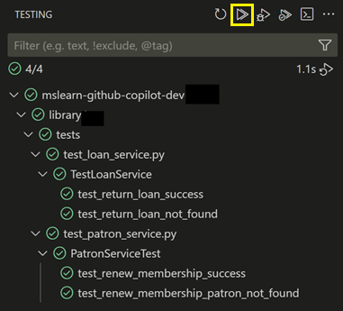
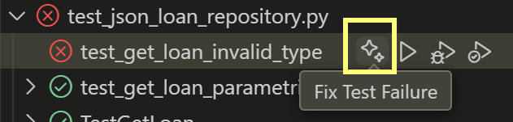

---
lab:
    title: 'Exercise - Develop unit tests using GitHub Copilot (Python)'
    description: 'Learn how to accelerate the development of unit tests using GitHub in Visual Studio Code.'
---

# Develop unit tests using GitHub Copilot

The large language models behind GitHub Copilot are trained on a variety of code testing frameworks and scenarios. GitHub Copilot is a great tool for generating test cases, test methods, test assertions and mocks, and test data. In this exercise, you use GitHub Copilot to accelerate the development of unit tests for a Python application.

This exercise should take approximately **25** minutes to complete.

> **IMPORTANT**: To complete this exercise, you must provide your own GitHub account and GitHub Copilot subscription. If you don't have a GitHub account, you can <a href="https://go.microsoft.com/fwlink/?linkid=2320148" target="_blank">sign up</a> for a free individual account and use a GitHub Copilot Free plan to complete the exercise. If you have access to a GitHub Copilot Pro, GitHub Copilot Pro+, GitHub Copilot Business, or GitHub Copilot Enterprise subscription from within your lab environment, you can use your existing GitHub Copilot subscription to complete this exercise.

## Before you start

Your lab environment must include the following: Git 2.48 or later, Python 3.10 or later, Visual Studio Code with the Python extension form Microsoft, and access to a GitHub account with GitHub Copilot enabled.

If you're using a local PC as a lab environment for this exercise:

- For help configuring your local PC as your lab environment, open the following link in a browser: <a href="https://microsoftlearning.github.io/mslearn-github-copilot-dev/Instructions/Labs/LAB_AK_00_configure_lab_environment_py.html" target="_blank">Configure your lab environment resources</a>.

- For help enabling your GitHub Copilot subscription in Visual Studio Code, open the following link in a browser: <a href="https://go.microsoft.com/fwlink/?linkid=2320158" target="_blank">Enable GitHub Copilot within Visual Studio Code</a>.

If you're using a hosted lab environment for this exercise:

- For help enabling your GitHub Copilot subscription in Visual Studio Code, paste the following URL into a browser's site navigation bar: <a href="https://go.microsoft.com/fwlink/?linkid=2320158" target="_blank">Enable GitHub Copilot within Visual Studio Code</a>.

- Open a command terminal and then run the following commands:

    To ensure that Visual Studio Code is configured to use the correct version of Python, verify your Python installation is version 3.10 or later:

    ```bash
    python --version
    ```

    To ensure that Git is configured to use your name and email address, update the following commands with your information, and then run the commands:

    ```bash

    git config --global user.name "John Doe"

    ```

    ```bash

    git config --global user.email johndoe@example.com

    ```

## Exercise scenario

You're a developer working in the IT department of your local community. The backend systems that support the public library were lost in a fire. Your team needs to develop a temporary project to help the library staff manage their operations until the system can be replaced. Your team chose GitHub Copilot to accelerate the development process.

You have an initial version of the library application that includes a unit test project named UnitTests. You need to accelerate the development of additional unit tests using GitHub Copilot.

This exercise includes the following tasks:

1. Set up the library application in Visual Studio Code.

1. Examine the approach to unit testing implemented by the UnitTests project.

1. Extend the UnitTests project to begin testing the data access classes in the library\infrastructure project.

## Set up the library application in Visual Studio Code

You need to download the existing application, extract the code files, and then open the project in Visual Studio Code.

Use the following steps to set up the library application:

1. Open a browser window in your lab environment.

1. To download a zip file containing the library application, paste the following URL into your browser's address bar: [GitHub Copilot lab - develop unit tests](https://github.com/MicrosoftLearning/mslearn-github-copilot-dev/raw/refs/heads/main/DownloadableCodeProjects/Downloads/AZ2007LabAppM4Python.zip)

    The zip file is named **AZ2007LabAppM4Python.zip**.

1. Extract the files from the **AZ2007LabAppM4Python.zip** file.

    For example:

    1. Navigate to the downloads folder in your lab environment.

    1. Right-click **AZ2007LabAppM4Python.zip**, and then select **Extract all**.

    1. Select **Show extracted files when complete**, and then select **Extract**.

1. Open the extracted files folder, then copy the **AccelerateDevGHCopilot** folder to a location that's easy to access, such as your Windows Desktop folder.

1. Open the **AccelerateDevGHCopilot** folder in Visual Studio Code.

    For example:

    1. Open Visual Studio Code in your lab environment.

    1. In Visual Studio Code, on the **File** menu, select **Open Folder**.

    1. Navigate to the Windows Desktop folder, select **AccelerateDevGHCopilot** and then select **Select Folder**.

1. In the Visual Studio Code EXPLORER view, verify the following project structure:

    - AccelerateDevGHCopilot/library
        ├── application_core
        ├── console
        ├── infrastructure
        └── tests

## Examine the approach to unit testing implemented by the tests directory

In this section of the exercise, you use GitHub Copilot to examine the unit testing approach implemented by the UnitTests project.

Use the following steps to complete this section of the exercise:

1. Expand the **tests** folder in the EXPLORER view.

    Your existing codebase includes a UnitTests project that implements the following folder structure:

    ─ tests
     ├─ test_patron_service.py

    The test project structure mirrors and supports 2 of the **services** portion of the **application_core** project.

   ─ application_core
    └─ services
       ├─ loan_service.py
       ├─ patron_service.py

1. Open the Chat view.

1. Add the following files to the Chat context:

    (under library\application_core\services\ )

    - loan_service.py
    - patron_service.py

    (under library\tests\ )

    - test_patron_service.py
    - test_loan_service.py

1. To learn about the existing unit test project, enter the following prompt:

    ```plaintext
    @workspace Explain the approach to unit testing that's been implemented in this workspace.
    ```

    This prompt asks GitHub Copilot to explain the approach to unit testing in the context of the workspace. Adding relevant files to the Chat context improves the response.

1. Take a minute to review GitHub Copilot's response.

    > You should see a description that's similar to the following example:
    >
    > This workspace uses a standard Python unit testing approach with the `unittest` framework and mocking via `unittest.mock.MagicMock`. The main features are:
    >
    > - **Test Classes**: Each service (e.g., `LoanService`, `PatronService`) has a corresponding test class (e.g., `TestLoanService`, `PatronServiceTest`).
    > - **Setup**: The `setUp` method creates a mock repository and injects it into the service under test, isolating business logic from data access.
    > - **Test Methods**: Each method tests a specific behavior, such as successful membership renewal or handling missing data.
    > - **Assertions**: Tests use assertions like `self.assertEqual` to verify expected outcomes.
    > - **Test Data**: Test objects (e.g., `Patron`, `Loan`) are created with relevant attributes for each scenario.
    > - **Test Discovery**: Each test file includes:
    >
    >     ```python
    >     if __name__ == "__main__":
    >         unittest.main()
    >     ```
    >
    > - **Mocking**: Repository methods are mocked to control return values and isolate logic.
    >
    > See examples in `library2/tests/test_patron_service.py` and `library2/tests/test_loan_service.py`.

1. To analyze the benefits of the current approach, enter the following prompt:

    ```plaintext
    @workspace What are the benefits of this approach to unit testing?
    ```

1. Take a minute to review GitHub Copilot's response.

    You can continue the conversation and ask for more details about specific aspects of the unit testing approach. For example, you can ask about the benefits of using test factories, mocking dependencies, or the overall structure of the tests.

1. Take a minute to consider how you would extend the existing approach to test the library\infrastructure project.

    The library\infrastructure project contains data access classes that interact with the file system to load and save data.

1. Add the following files to the Chat context:

    - library\application_core\services\loan_service.py
    - library\application_core\services\patron_service.py

    - library\application_core\enums\loan_extension_status.py
    - library\application_core\enums\loan_return_status.py
    - library\application_core\enums\membership_renewal_status.py

    - library\tests\test_patron_service.py
    - library\tests\test_loan_service.py

1. To ask GitHub Copilot for help extending the UnitTests project, enter the following prompt:

    ```plaintext
    @workspace How can I extend the `tests` project to begin testing methods in the `library\infrastructure` project? 
    Provide a process overview.
    ```

    This prompt asks GitHub Copilot to provide a process overview for extending the UnitTests project to begin testing methods in the library\infrastructure project. Several files are included in the prompt to provide context for the response.

1. Take a minute to review the response from GitHub Copilot.

    >You should see an explanation that's similar to the following example:
    >
    >To extend the `tests` project to cover methods in the `library4Test/infrastructure` project, follow this process:
    >
    >1. **Identify Target Methods**  
    >   Review the code in `infrastructure/` (e.g., `json_data.py`, `json_loan_repository.py`, `json_patron_repository.py`) and select the methods you want to test.
    >
    >2. **Create New Test Files**  
    >   In the `tests/` directory, create new test files such as `test_json_data.py`, `test_json_loan_repository.py`, etc., following the naming convention used for existing tests.
    >
    >3. **Import Classes/Functions**  
    >   In each new test file, import the relevant classes or functions from the `infrastructure` module.
    >
    >4. **Write Test Classes and Methods**  
    >   - Use `unittest.TestCase` as the base class.
    >   - Implement `setUp` if you need to initialize objects or test data.
    >   - Write test methods for each behavior or edge case you want to verify.
    >
    >5. **Mock External Dependencies**  
    >   If the infrastructure code interacts with files or external systems, use `unittest.mock` to mock those dependencies, ensuring tests are isolated and repeatable.
    >
    >6. **Use Assertions**  
    >   Use assertions (`self.assertEqual`, `self.assertTrue`, etc.) to check that the methods behave as expected.
    >
    >7. **Run and Refine Tests**  
    >   Run your tests using the command line or your IDE’s test runner. Refine your tests and code as needed based on the results.
    >
    >**Example Skeleton:**
    >
    >```python
    >import unittest
    >from infrastructure.json_data import JsonData  # Adjust import as needed
    >
    >class TestJsonData(unittest.TestCase):
    >    def test_some_method(self):
    >        # Arrange
    >        # Act
    >        # Assert
    >        pass
    >
    >if __name__ == "__main__":
    >    unittest.main()
    >```
    >
    >**Summary:**  
    >
    >- Add new test files in `tests/` for each infrastructure module.
    >- Import and test methods using `unittest`.
    >- Mock external dependencies as needed.
    >- Use assertions to verify behavior.
    >&nbsp;

Your results will likely differ slightly, examine them closely.

    > **TIP**: Use GitHub Copilot's **Ask** mode to investigate your approach to testing. Use the responses to plan, develop, or extend your unit tests.

## Extend the UnitTests project to begin testing data access classes

The **library\infrastructure** files contain data access classes that interact with the file system to load and save data. The project includes the following classes:

- JsonData (`json_data.py`): A class that loads and saves JSON data.
- JsonLoanRepository (`json_loan_repository.py`): A class that implements the ILoanRepository interface and uses the JsonData class to load and save loan data.
- JsonPatronRepository (`json_patron_repository.py`): A class that implements the IPatronRepository interface and uses the JsonData class to load and save patron data.

### Use Agent mode to create a new test class

You can use the Chat view's Agent mode when you have a specific task in mind and want to enable Copilot to autonomously edit your code. For example, you can use Agent mode to create and edit files, or to invoke tools to accomplish tasks. In Agent mode, GitHub Copilot can autonomously plan the work needed and determine the relevant files and context. It then makes edits to your codebase and invokes tools to accomplish the request you made.

> **NOTE**: The Agent mode is only available in Visual Studio Code. If you're using GitHub Copilot in a different environment, you can use the Chat mode to accomplish similar tasks.

In this section of the exercise, you use GitHub Copilot's Agent mode to create a new test class for the GetLoan method of the JsonLoanRepository class.

Use the following steps to complete this section of the exercise:

1. In the Chat view, select the **Set Mode** button, and then select **Agent**.

    > **IMPORTANT**: When you use the Chat view in agent mode, GitHub Copilot may make multiple premium requests to complete a single task. Premium requests can be used by user-initiated prompts and follow-up actions Copilot takes on your behalf. The total number of premium requests used is based on the complexity of the task, the number of steps involved, and the model selected.

1. To start an automated task that creates a test class for the JsonLoanRepository.get_loan method (infrastructure\json_loan_repository.py), enter the following prompt:

    ```plaintext

    Add a `test_json_loan_repository.py` file to the **library\tests** directory. Create a class named `TestJsonLoanRepository`. 
    In the `TestJsonLoneRepository` class create a stub class named `get_loan`. Add a reference to classes tested.

    ```

    This prompt asks GitHub Copilot to create a new class file in the tests project folder.

    - tests\
      - test_json_loan_repository.py

    The prompt also asks GitHub Copilot to add a reference to **library\infrastructure**.

1. Take a minute to review the response from GitHub Copilot.

    Notice the following updates in the Chat view and code editor:

    - The agent displays status messages as it completes the requested tasks. The first task will be to create the **test_json_loan_repository.py** file. The agent may pause and ask you for confirmation before creating the file.

        

    - The **test_json_loan_repository.py** file is open in the code editor with edits similar to the following update:

        ```python

        import unittest
        from infrastructure.json_loan_repository import JsonLoanRepository
        from infrastructure.json_data import JsonData
        from application_core.entities.loan import Loan
        
        class TestJsonLoanRepository(unittest.TestCase):
            def get_loan(self):
                # Stub for get_loan test
                pass
        
        if __name__ == "__main__":
            unittest.main()

        ```

1. If the agent pauses the task and asks you for permission to run a make directory command in the terminal, select **Keep** or **Continue**.

    When you select  **Keep** or **Continue**, GitHub Copilot completes the following actions:

    - A new file named **test_json_loan_repository.py** is created in the **tests** folder.

1. Take a moment to review the updates.

    You should see the following updates in the editor:

    - The **tests** folder now includes **test_json_loan_repository.py** with a reference to **infrastructure.json_loan_repository**.

1. In the Chat view, to accept all changes, select **Keep**.

1. In the EXPLORER view, expand the **library\tests** folder.

    You should see the following folder structure:

    tests
      ├─ test_json_loan_repository.py
      ├─ test_loan_service.py
      └─ test_patron_service.py

### Prepare to create unit tests for the GetLoan method

In this section of the exercise, you use GitHub Copilot's Edit mode to create unit tests for the **GetLoan** method in the **JsonLoanRepository** class (**json_loan_repository.py**).

Use the following steps to complete this section of the exercise:

1. In the Chat view, select the **Set Mode** button, and then select **Edit**.

    Use the Edit mode to update selected files. Responses are displayed as code suggestions in the code editor.

1. Open the **json_loan_repository.py** file from the **library\infrastructure** folder.

1. Take a minute to review the **json_loan_repository.py** file.

    ```python
    import json
    from datetime import datetime
    from application_core.interfaces.iloan_repository import ILoanRepository
    from application_core.entities.loan import Loan
    from .json_data import JsonData
    from typing import Optional
    
    class JsonLoanRepository(ILoanRepository):
        def __init__(self, json_data: JsonData):
            self._json_data = json_data
    
        def get_loan(self, loan_id: int) -> Optional[Loan]:
            for loan in self._json_data.loans:
                if loan.id == loan_id:
                    return loan
            return None
    
        def update_loan(self, loan: Loan) -> None:
            for idx in range(len(self._json_data.loans)):
                if self._json_data.loans[idx].id == loan.id:
                    self._json_data.loans[idx] = loan
                    self._json_data.save_loans(self._json_data.loans)
                    return
    
        def add_loan(self, loan: Loan) -> None:
            self._json_data.loans.append(loan)
            self._json_data.save_loans(self._json_data.loans)
            self._json_data.load_data()
    
        def get_loans_by_patron_id(self, patron_id: int):
            result = []
            for loan in self._json_data.loans:
                if loan.patron_id == patron_id:
                    result.append(loan)
            return result
    
        def get_all_loans(self):
            return self._json_data.loans
    
        def get_overdue_loans(self, current_date):
            overdue = []
            for loan in self._json_data.loans:
                if loan.return_date is None and loan.due_date < current_date:
                    overdue.append(loan)
            return overdue
    
        def sort_loans_by_due_date(self):
            # Manual bubble sort for demonstration
            n = len(self._json_data.loans)
            for i in range(n):
                for j in range(0, n - i - 1):
                    if self._json_data.loans[j].due_date > self._json_data.loans[j + 1].due_date:
                        self._json_data.loans[j], self._json_data.loans[j + 1] = self._json_data.loans[j + 1], self._json_data.loans[j]
            return self._json_data.loans


    ```

1. Notice the following Methods in **`JsonLoanRepository`**:

    - `__init__(self, json_data: JsonData)`: Initializes repository with a `JsonData` object.
    - `get_loan(self, loan_id: int) -> Optional[Loan]`: Retrieves a loan by its ID.
    - `update_loan(self, loan: Loan) -> None`: Updates an existing loan and saves changes.
    - `add_loan(self, loan: Loan) -> None`: Adds a new loan, saves, and reloads data.
    - `get_loans_by_patron_id(self, patron_id: int)`: Gets all loans for a specific patron.
    - `get_all_loans(self)`: Returns all loans.
    - `get_overdue_loans(self, current_date)`: Returns loans overdue as of `current_date`.
    - `sort_loans_by_due_date(self)`: Sorts loans by due date using bubble sort.
    - Also, `get_loans_by_patron_id` and `get_overdue_loans`) return lists of loans, and that `sort_loans_by_due_date` sorts in place and returns the sorted list.

1. Use of objects to load and save data:

    - Use a `JsonData` object (`self._json_data`) to access and modify the in-memory list of loans.
    - Persists changes by calling `self._json_data.save_loans(self._json_data.loans)`.
    - After adding a loan, calls `self._json_data.load_data()` to refresh in-memory data from storage.

1. Take a minute to consider the JsonLoanRepository Class: Field and Constructor Requirements

**Field:**

- `self._json_data`:  
  An instance of `JsonData`. This field holds the in-memory list of loans and provides methods to load and save loan data to persistent storage (such as a JSON file).

**Constructor:**

- `__init__(self, json_data: JsonData)`:  
  The constructor requires a `JsonData` object as a parameter. This object is assigned to `self._json_data` and is used by all repository methods to access and persist loan data.

**How Methods Use the Field:**

- All methods (`get_loan`, `update_loan`, `add_loan`, `get_loans_by_patron_id`, `get_all_loans`, `get_overdue_loans`, `sort_loans_by_due_date`) interact with the loan data through `self._json_data.loans`.
- Methods that modify data (`update_loan`, `add_loan`) call `self._json_data.save_loans()` to persist changes.
- `add_loan` also calls `self._json_data.load_data()` to refresh the in-memory data after saving.

The **JsonLoanRepository.get_loan** method receives a `loan_id` parameter when called. The method searches through `self._json_data.loans` for a loan with a matching ID. If a matching loan is found, it returns the populated `Loan` object. If no matching loan is found, it returns `None`.

For unit testing `get_loan`:

- You can use a mock loan repository object to test the case where a matching ID is found. Load the mock with the loan you want to find, and use a test class to mock the ILoanRepository interface and instantiate a mock repository.
- Similarly, you can use a mock patron repository object to test the scenario where a specific patron exists. Populate the mock with the patron you want to retrieve, and use a test class to mock the IPatronRepository interface and instantiate a mock repository. This approach allows you to simulate both successful retrieval and not-found cases for different repository types.
- You can use a real `JsonLoanRepository` object to test the case where no matching ID is found. Specify a loan ID that you know isn't present (e.g., a value over 100).
- You'll need a `JsonData` object to create a real `JsonLoanRepository`. If your test project doesn't have access to the production `JsonData`, create a test instance or mock as needed.

### Use the Edit mode to create unit tests

**Files to include for context in tests:**

- From the **application_core/entities** folder.
  - `loan.py` (Loan entity)
- From the **application_core/services** folder.
  - `loan_service.py`
- From the **infrastructure** folder.
  - `json_data.py`
  - `json_loan_repository.py`
- From the **tests** folder.
  - `test_json_loan_repository.py`
  
1. Enter the following Edit prompt:

    ```plaintext

    #Codebase Create fields and a class constructor for the `test_json_loan_repository.py` file to support unit tests for the get_loan method in the JsonLoanRepository class. Add private fields: _mock_loan_repository, _json_loan_repository, and _json_data. Initialize these fields in the class constructor or in a setUp (for unittest) or setup_method (for pytest). Use a setup method or fixture to populate _json_data with test data for instantiating JsonLoanRepository.
    ```

    This prompt asks GitHub Copilot to suggest fields and a class constructor.

1. Take a minute to review the response from GitHub Copilot.

    You may see a code suggestion that's similar to the following code snippet:

    ```python

    import unittest
    from unittest.mock import MagicMock
    from infrastructure.json_loan_repository import JsonLoanRepository
    from infrastructure.json_data import JsonData
    from application_core.entities.loan import Loan
    from application_core.entities.book_item import BookItem
    from application_core.entities.patron import Patron
    from datetime import datetime, timedelta
    
    class TestJsonLoanRepository(unittest.TestCase):
        def setUp(self):
            # Create a mock JsonData with minimal test data
            self._json_data = MagicMock(spec=JsonData)
            # Create a test loan and supporting objects
            test_patron = Patron(id=1, name="Test Patron", membership_end=datetime.now()+timedelta(days=30), membership_start=datetime.now()-timedelta(days=365))
            test_book_item = BookItem(id=1, book_id=1, acquisition_date=datetime.now()-timedelta(days=100))
            test_loan = Loan(id=1, book_item_id=1, patron_id=1, patron=test_patron, loan_date=datetime.now()-timedelta(days=10), due_date=datetime.now()+timedelta(days=4), return_date=None, book_item=test_book_item)
            self._json_data.loans = [test_loan]
            self._json_loan_repository = JsonLoanRepository(self._json_data)
            self._mock_loan_repository = MagicMock()
    
        def get_loan(self):
            # Stub for get_loan test
            pass
    
    if __name__ == "__main__":
        unittest.main()

    ```

1. In the Chat view (Edit mode), to accept all updates, select **Keep**.

1. Add the following files to the Chat context:

    - library/
        - application_core/entities/**loan.py**
        - infrastructure/**json_data.py**
        - infrastructure/**json_loan_repository.py**
        - tests/**test_json_loan_repository.py**

1. Select the contents of the **test_json_loan_repository.py** file, and then enter the following prompt in the Chat view:

    ```plaintext
    @workspace Update the `test_json_loan_repository` test file and address the following:
    - Use import system paths to the relative library root that match this project’s folder structure.
    - Ensure the Loan class is imported correctly.
    - Confirm datetime and timedelta are imported if used.
    - Add any missing methods as stubs for later completion to DummyJsonData that are required by JsonLoanRepository.
    - Remove any unused variables.
    - Remove any unnecessary or incorrect imports.
    - Use unittest standards
    ```

    This prompt asks GitHub Copilot to suggest a unit test for the `JsonLoanRepository.get_loan` method in Python. The unit test should verify the scenario where a loan ID exists in the test data. The test should use a `DummyJsonData` instance to provide sample loans, create a `JsonLoanRepository` with this data, call `get_loan` with a valid loan ID, and use assertions to check that the returned loan has the expected ID. The loan ID should be present in the `DummyJsonData.loans` list.

1. Take a minute to review the `test_patron_service.py` updates suggested by GitHub Copilot.

    You should see a code suggestion that's similar to the following code snippet:

    ```python

    import sys
    import unittest
    from pathlib import Path
    sys.path.append(str(Path(**file**).resolve().parent.parent))
    from infrastructure.json_loan_repository import JsonLoanRepository
    from application_core.entities.loan import Loan
    from application_core.entities.book_item import BookItem
    from application_core.entities.patron import Patron
    from datetime import datetime, timedelta
    
    class DummyJsonData:
        def **init**(self):
            self.loans = []
            self.save_loans_called = False
    
        def save_loans(self, loans):
            self.save_loans_called = True
    
        def load_data(self):
            pass
    
    class TestJsonLoanRepository(unittest.TestCase):
        def setUp(self):
            self._json_data = DummyJsonData()
            test_patron = Patron(id=1, name="Test Patron", membership_end=datetime.now()+timedelta(days=30), membership_start=datetime.now()-timedelta(days=365))
            test_book_item = BookItem(id=1, book_id=1, acquisition_date=datetime.now()-timedelta(days=100))
            test_loan = Loan(id=1, book_item_id=1, patron_id=1, patron=test_patron, loan_date=datetime.now()-timedelta(days=10), due_date=datetime.now()+timedelta(days=4), return_date=None, book_item=test_book_item)
            self._json_data.loans = [test_loan]
            self._json_loan_repository = JsonLoanRepository(self._json_data)
    
        def test_get_loan(self):
            loan = self._json_loan_repository.get_loan(1)
            self.assertIsNotNone(loan)
            self.assertEqual(loan.id, 1)
    
        def test_get_loan_not_found(self):
            loan = self._json_loan_repository.get_loan(999)
            self.assertIsNone(loan)
    
    if **name** == "**main**":
        unittest.main()

    ```

1. You should notice that the test file now uses a minimal `DummyJsonData` class with only the required methods, corrects all import paths, removes unused variables and imports, and ensures the Loan class and datetime utilities are imported properly.

1. In the Chat view, to accept all updates, select **Keep**.

1. Run unittest tests on portions of the **AccelerateDevGitHubCopilot** project to ensure there are no obvious errors. In the terminal at the \library prompt enter:

    ```plaintext
    python -m unittest discover -v tests
    ```

1. Compare to running pytest (expect same result with different output formats).

    ```plaintext
    pytest tests -v
    ```

1. manually test:

    ```plaintext
    python console\main.py
    ```

    A basic test is to:
        1. search for user name, enter: **one**
        1. select a listed patron, enter: **1**
        1. select "b", enter: **b**
        1. search for a book: **Twenty**
        1. checkout book, enter: **y**
        1. quit, enter: **q**

### Use Copilot Inline editor Chat to create unit tests

1. Use the inline editor chat feature in **test_json_loan_repository.py** to create a test for the case where the loan ID isn't found.

    Select **`class TestJsonLoanRepository`**: and prompt with:

    ```plaintext
   I need to ensure 2 test cases are created for this class.  Identify or create one test cases for where the loan `Id` is found, and one when loan `Id` isn't found. No more than 2 more basic test cases are needed.
    ```

    Accept the suggestions to create a new test method.

1. Take a minute to review the new unit text.

    You should see a suggested unit text that's similar to the following code snippets:

    ```python

    class TestJsonLoanRepository(unittest.TestCase):
        # ...existing code...

        def test_get_loan_found(self):
            # Test case where loan with id=1 exists
            found_loan = self._json_loan_repository.get_loan(1)
            self.assertIsNotNone(found_loan)
            self.assertEqual(found_loan.id, 1)
    
        def test_get_loan_not_found_again(self):
            # Test case where loan with id=2 does not exist
            not_found_loan = self._json_loan_repository.get_loan(2)
            self.assertIsNone(not_found_loan)

    ```

    >**NOTE** Coplot Inline Chat might also crate some mocking data, depending on the implementation.

### Enable Pytest

Compared to Unittest, Pytest some advantages such as concise syntax, features like fixtures and parameterization, and better failure reporting. Pytest makes tests easier to write and maintain and Pytest runs Unittest test cases.

1. Pytest is enabled from the install of the <a href="https://marketplace.visualstudio.com/items?itemName=ms-python.python" target="_blank">Visual Studio Microsoft Python extension</a>, install if needed.

1. Select the flask icon   on the toolbar once tests are discovered. If the icon isn't present review the previous instructions

1. Choose "Configure Python Tests" or if previously configured:

1. if the tests haven't been configured or are testing the correct project go to the next step. If you need to change the test project continue with:
    - `Ctrl+Shift+P` to open the Command Palette.
    - enter **"Python: Configure Tests"**.
    - Select "pytest."
    - Select the directory for your python code.
    - Select the play icon to run tests.

1. Select Pytest from the options.

1. Choose the folder containing your test code (`library\`)

1. Select the play icon to run tests.
    

1. Optionally, run the ptytest command from the `library` path in the terminal passing the path to the **tests** folder and the `-v` "verbose" command `-vv` command (or `-vv` "very verbose"):

    ```plaintext
    pytest tests -v
    ```

>**NOTE** Further assistance with PyTest configuration is available in the articles: <a href="https://marketplace.visualstudio.com/items?itemName=ms-python.python" target="_blank">Visual Studio Microsoft Python extension</a> and <a href="https://code.visualstudio.com/docs/python/testing" target="_blank">Python testing in Visual Studio Code</a>.

The previous steps & command will run your Unittest (and Pytest test) cases.

    >**NOTE**: Although the code was run using **Pytest** the report states that the **unittest** framework was used because there are no Pytest specific test formatted items created at this point in the lab. **Pytest** also runs all **unitest** formatted tests along with any Pytest test cases.

### Include Pytest test cases

Add Pytest-style test functions with GitHub Copilot Chat **Edit mode**, Provide the following files from library\tests:

- test_json_loan_repository.py
- test_loan_service.py
- test_patron_service.py

1. Use the following prompt:

    ```plaintext
    
        Add new Pytest-style test functions to the following files: test_json_loan_repository.py, test_loan_service.py, and test_patron_service.py. 
        - Do not remove or rewrite existing Unittest-based test classes or methods.
        - Import pytest at the top if not already present.
        - For each file, add:
            - At least one parameterized test using @pytest.mark.parametrize.
            - At least one fixture using @pytest.fixture for reusable setup.
            - At least one test using pytest.raises for exception/assertion testing.
        - Name all new Pytest test functions with the test_ prefix.
        - Clearly separate new Pytest functions from existing Unittest classes.
        - If a fixture or parameterized test needs a dummy or mock class, define it within the file or reuse an existing one.
        - Demonstrate how Pytest makes tests more concise and expressive compared to Unittest.
    
    ```

1. Review the added test cases and **save**. You will test in the next section.

## Run the unit tests using Pytest

1. Use the toolbar method, select the flask icon  on the toolbar. Select the play icon to run tests.
    .

1. To fix test Errors or test failures use the . Apply the fix provide.

    - If the fix has to be made another file it can easier to select open in chat. and ask Copilot to provide the fit

    ```plaintext
    @workspace provide the fix for the test failure
    ```

## Summary
<!-- HERE -->
In this exercise, you learned how to use GitHub Copilot to accelerate the development of unit tests in a Python application ato use Pytest and run. You used GitHub Copilot's Chat view in Ask mode, Agent mode, and Edit mode. You used Ask mode to examine the existing unit testing approach, Agent mode to create project folders and a new test class, and Edit mode to create unit tests. You also used GitHub Copilot's code completion feature to create a unit test.

## Clean up

Now that you've finished the exercise, take a minute to ensure that you haven't made changes to your GitHub account or GitHub Copilot subscription that you don't want to keep. If you made any changes, revert them now.
